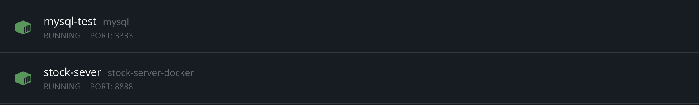

# Stock History Project

This project  build a stock price backend server, providing functions via api requests. It used  Spring boot and mysql database and can be deployed as docker images. Besides, It provides a high-avilable spring cloud eureka cluster and a service consumer applied weighted response time load balancing stategy.

## Part1: yahooFinance 
This part includes the scripts and downloaded US stock data for testing.
Before coding, data size estimation is necessay. 

```
current us market(AM+NY+NSDAQ) symbols count: 7000 (derivative exclusive)
Assume 250 trading days per year and total 40 years:
7000*250*40 = 70 millions records
```
The number of records is too large for one table. If the query response time is slow, table partition is required in the future.

## Part2: stock 


This part provides all API services as the image including get/update/delete stock history APIs. For update stock history API,  it is implemented by multi-threading and batch save/update. It also integrated with swagger 2 as a restful API documention.

Other functions:
- API token authorization. It applied a self-defined annanotation @AuthToken and a AOP interceptor to do the validation.
- Global exception handler and unified response format.

For docker deployment, implement the dokerfile script and deploy the mysql and application to different containers.




## Part3: Spring-cloud-eureka-cluster
As a eureka server cluster, it provides high avialiblity of service registry and service lookup like the following architechture. 


The following image shows that the peer1 server has two available replicas: peer2, peer3.


## part4 : Spring-cloud-eureka-consumer 
As a service consumer, this part focus on call APIs of service provider after getting the information from eureka registry server.  This part are mainly implemented by ConsumerController.
For the load balance, defined a new class that set the rule of load balance.
This class will be applied as parameter for annanotation of @RibbonClient.
```
@Bean
public IRule iRule() {
	return new WeightedResponseTimeRule();
}
```
Finally, it achieves the goal as following picture.


## TO DO 
- divide the stocks into different types : derivatives etc. and set up more than 1 data source.
- Integration with mockito for unit test.  [mockito](https://javadoc.io/static/org.mockito/mockito-core/3.3.3/org/mockito/Mockito.html#0).
- table partitioning/sharding. Try the [ShardingSphere](https://shardingsphere.apache.org/). 

 