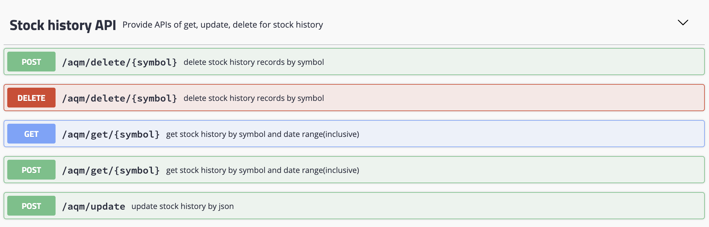
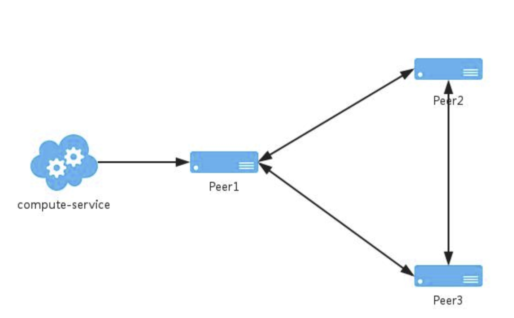
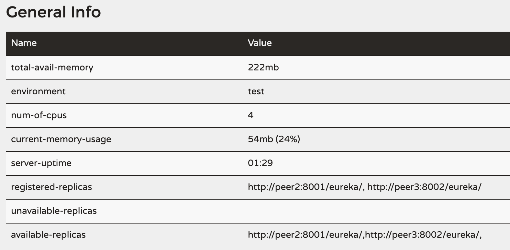
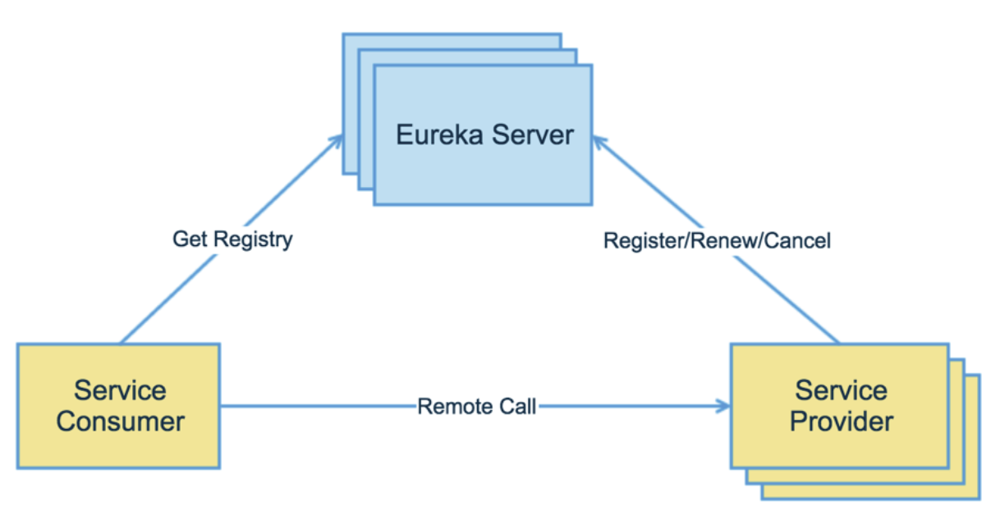

# StockHistoryProject

This project  build a stock price backend server, providing functions via api requests. It also provide a high-avilable spring cloud eureka cluster and a service consumer client applied weighted response time load balancing stategy.

## Part1: yahooFinance 
This folder includes the scripts and downloaded US stock data for testing.
Before coding, data size estimation is necessay. 
```
current us market(AM+NY+NSDAQ) symbols count: 7000(derivative exclusive)
Assume 250 trading days and total 40 years:
7000*250*40 = 70 millions records
```
The number of records is too large for one mysql table. If the query response time is slow, table partition is required in the future.

## Part2: stock 


This folder contains all backend services including get/update/delete stock history APIs. For update stock history API, query historical price by symbols and time range. It is implemented by multi-threading and batch save/update. 

Other functions:
- API token authorization. It applied a self-defined annanotation @AuthToken and a AOP interceptor to do the validation.
- Global exception handler and unified response format.

It also integrate with swagger 2 as a restful API documention.
Besides, docker-compose.yaml and dockerfile is created for docker deployment.

## Part3: Spring-cloud-eureka-cluster folder
As the eureka server cluster, it provide high avialiblity of service registry and service lookup. 



The following image shows that the peer1 server has two available replicas: peer2, peer3.


## part4 : Spring-cloud-eureka-consumer 
As a service consumer, this part focus on call APIs of service provider after getting the information from eureka registry server.  This part are mainly implemented by ConsumerController.
For the load balance, defined a new class that set the rule of load balance.
This class will be applied as parameter for annanotation of @RibbonClient.
```
@Bean
public IRule iRule() {
	return new WeightedResponseTimeRule();
}
```
Finally, it archives the goal as following picture.



## TO DO 
- config the Docker/Docker compose on my local machine and then share the docker images. (tried but failed)
- divide the stocks into different types : derivatives etc. 
- Integration with mockito for unit test.  [mockito](https://javadoc.io/static/org.mockito/mockito-core/3.3.3/org/mockito/Mockito.html#0).
- table partitioning/sharding. Try the [ShardingSphere](https://shardingsphere.apache.org/). 

 